# Receipt & Warranty Feature - Setup Guide

## Overview
Complete backend implementation for receipt and warranty management with OCR extraction.

## Completed Work

### 1. Database Migration (022_add_receipt_fields)
- **Files**: `backend/db/migrations/022_add_receipt_fields.{up,down}.sql`
- **Schema Changes**:
  - Added to `items` table: `purchase_date`, `purchase_price`, `purchase_store`, `warranty_until`
  - Created `item_receipts` table with 9 fields including OCR data
  - Added indexes on `item_id` and `uploaded_at`

### 2. Storage Configuration
- **File**: `backend/storage/index.ts`
- Added `itemReceipts` bucket for receipt images and thumbnails

### 3. Backend API Endpoints (5 files)

#### upload_receipt.ts
- **Endpoint**: `POST /item/upload-receipt`
- **Functionality**: 
  - Accepts base64 image
  - Uses sharp to resize (max 1200px width)
  - Converts to WebP (85% quality)
  - Creates 300x300 thumbnail
  - Uploads to itemReceipts bucket
  - Returns URLs

#### extract_receipt_data.ts
- **Endpoint**: `POST /item/extract-receipt-data`
- **Functionality**:
  - Uses Google Cloud Vision API for OCR
  - Extracts store name (first few lines)
  - Extracts date (MM/DD/YYYY, YYYY-MM-DD, Month DD YYYY)
  - Extracts price (looks for "total", "$XX.XX")
  - Returns structured data + raw text

#### add_receipt.ts
- **Endpoint**: `POST /item/add-receipt`
- **Functionality**:
  - Inserts receipt into database
  - Verifies household access
  - Stores extracted OCR data
  - Returns ItemReceipt object

#### list_receipts.ts
- **Endpoint**: `GET /item/:itemId/receipts`
- **Functionality**:
  - Lists all receipts for an item
  - Verifies household access
  - Orders by upload date (newest first)
  - Returns array of receipts

#### delete_receipt.ts
- **Endpoint**: `DELETE /item/receipt/:receiptId`
- **Functionality**:
  - Verifies household access
  - Deletes from database
  - Removes files from storage
  - Returns success status

### 4. Dependencies Installed
```bash
npm install --workspace=backend sharp @google-cloud/vision
```
- **sharp**: Image processing (resize, WebP conversion)
- **@google-cloud/vision**: OCR text extraction

## Setup Instructions

### Run Database Migration
```bash
cd c:\Users\lshan\WhereIsItMobile
encore db migrate
```

### Google Cloud Vision API Setup

1. **Create Google Cloud Project**
   - Go to https://console.cloud.google.com
   - Click "Create Project"
   - Name: "WhereIsIt-OCR" (or your preference)
   - Click "Create"

2. **Enable Vision API**
   - In your project, go to "APIs & Services" > "Library"
   - Search for "Cloud Vision API"
   - Click "Enable"

3. **Create Service Account**
   - Go to "IAM & Admin" > "Service Accounts"
   - Click "Create Service Account"
   - Name: "whereisit-ocr-service"
   - Role: "Cloud Vision API User"
   - Click "Done"

4. **Generate JSON Key**
   - Click on the service account you just created
   - Go to "Keys" tab
   - Click "Add Key" > "Create new key"
   - Choose "JSON" format
   - Click "Create" (file downloads automatically)

5. **Configure Encore**
   - Save the JSON key file to: `c:\Users\lshan\WhereIsItMobile\backend\google-vision-key.json`
   - Add to `.gitignore`:
     ```
     backend/google-vision-key.json
     ```

6. **Set Environment Variable**
   
   **Option A - For Development (Encore):**
   Create `encore.dev/secrets`:
   ```bash
   encore secret set --type dev GOOGLE_APPLICATION_CREDENTIALS
   # Enter the full path when prompted:
   c:\Users\lshan\WhereIsItMobile\backend\google-vision-key.json
   ```

   **Option B - For Local Testing:**
   Add to PowerShell profile or run before starting:
   ```powershell
   $env:GOOGLE_APPLICATION_CREDENTIALS = "c:\Users\lshan\WhereIsItMobile\backend\google-vision-key.json"
   ```

   **Option C - System Environment Variable:**
   - Open System Properties > Advanced > Environment Variables
   - Add new User variable:
     - Name: `GOOGLE_APPLICATION_CREDENTIALS`
     - Value: `c:\Users\lshan\WhereIsItMobile\backend\google-vision-key.json`

## Frontend Integration

### Remove Temporary Code
The frontend currently has temporary stubs. After backend is working:

1. **Remove temporary ItemReceipt type** from:
   - `frontend/components/ReceiptViewer.tsx`
   - `frontend/components/ItemDetailDialog.tsx`

2. **Uncomment backend calls** in:
   - `frontend/components/ReceiptViewer.tsx` (deleteReceipt)
   - `frontend/components/ItemDetailDialog.tsx` (loadReceipts)

3. **Update client types**:
   ```bash
   cd frontend
   npm run type-check
   ```

## Testing the Feature

### 1. Test Upload
```typescript
// In frontend
const file = // ... user selected file
const base64 = await fileToBase64(file);
const { receiptUrl, thumbnailUrl } = await backend.item.uploadReceipt({ base64Image: base64 });
```

### 2. Test OCR Extraction
```typescript
const data = await backend.item.extractReceiptData({ imageUrl: receiptUrl });
// Check: data.extractedDate, data.extractedPrice, data.extractedStore
```

### 3. Test Add Receipt
```typescript
await backend.item.addReceipt({
  itemId: 123,
  receiptUrl,
  thumbnailUrl,
  receiptType: 'purchase',
  description: 'Store receipt',
  extractedDate: data.extractedDate,
  extractedPrice: data.extractedPrice,
  extractedStore: data.extractedStore
});
```

### 4. Test List & Delete
```typescript
const { receipts } = await backend.item.listReceipts({ itemId: 123 });
await backend.item.deleteReceipt({ receiptId: receipts[0].id });
```

## API Usage Flow

### Complete Upload Flow

```mermaid
graph LR
    A[User Selects Image] --> B[Frontend: Compress to 1MB]
    B --> C[uploadReceipt API]
    C --> D[Sharp: Resize & WebP]
    D --> E[Upload to Bucket]
    E --> F[Return URLs]
    F --> G[extractReceiptData API]
    G --> H[Google Vision OCR]
    H --> I[Parse Text]
    I --> J[addReceipt API]
    J --> K[Save to Database]
```


## Cost Considerations

### Google Cloud Vision API Pricing
- First 1,000 text detection requests/month: **FREE**
- After 1,000: $1.50 per 1,000 requests
- For typical household use (<50 receipts/month): **$0**

### Storage Costs (Encore Buckets)
- WebP compression saves ~70% vs original
- 1200px max width keeps files <200KB typically
- 100 receipts ≈ 20MB storage

## Troubleshooting

### "Cannot find module 'sharp'"
```bash
cd c:\Users\lshan\WhereIsItMobile
npm install --workspace=backend sharp
```

### "Google Cloud Vision authentication error"
- Verify GOOGLE_APPLICATION_CREDENTIALS path is correct
- Check JSON key file exists and is valid
- Ensure Vision API is enabled in Google Cloud Console

### "Receipt not uploaded"
- Check bucket configuration in storage/index.ts
- Verify encore daemon is running
- Check backend logs for errors

### OCR not extracting data
- Receipt image may be low quality
- Try with clearer/higher resolution image
- Check raw OCR text in response for debugging

## Next Steps

1. **Run migration**: `encore db migrate`
2. **Setup Google Cloud** (follow steps above)
3. **Start backend**: `encore run`
4. **Test upload** with a receipt image
5. **Update frontend** to remove temporary code
6. **Add warranty expiration alerts** (already have WarrantyWidget component)

## Files Modified/Created

### Backend
- `backend/storage/index.ts` (modified)
- `backend/db/migrations/022_add_receipt_fields.up.sql` (new)
- `backend/db/migrations/022_add_receipt_fields.down.sql` (new)
- `backend/item/upload_receipt.ts` (new)
- `backend/item/extract_receipt_data.ts` (new)
- `backend/item/add_receipt.ts` (new)
- `backend/item/list_receipts.ts` (new)
- `backend/item/delete_receipt.ts` (new)

### Frontend (already created)
- `frontend/components/ReceiptUploader.tsx`
- `frontend/components/ReceiptViewer.tsx`
- `frontend/components/WarrantyWidget.tsx`
- `frontend/components/ItemDetailDialog.tsx` (modified)
